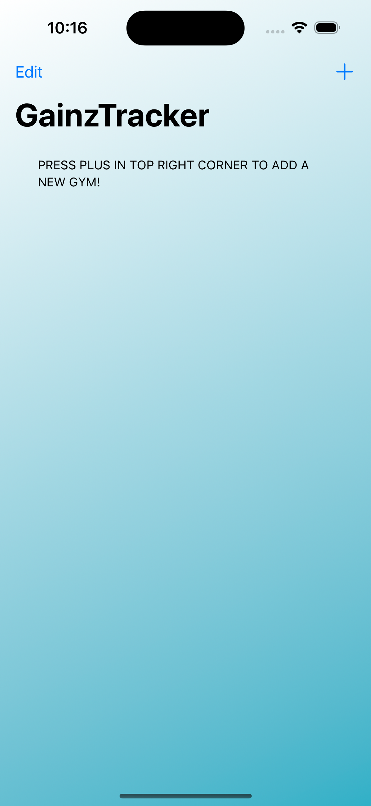

# GainzTracker
This SwiftUI Project is an app that allows users to be able to easily track their weights for different gyms that they use. This is my first big SwiftUI project and it taught me many necessary core concepts such as SwiftData, NavigationLinks, and Dictionarys. Using SwiftData I was able to store the users data right inside the app so that they never have to worry about losing the data they store in the App. This app is for all gym users new and old and the interface makes it very easy to learn how to add your workouts to the gym of their choice. Overall I am very happy with how the app turned out and I am excited to create more amazing apps using Xcode and SwiftUI.

## Bellow are Photos of the App in Action!

First when you load into the app you get greated with this screen.

This gives the user a very easy way to understand how the app works even when they just open the app.

After the User adds gyms to their collection the view will look like this.

When the user clicks on their gym they will be shown all of the different workouts with corresponding weights shown in a manner like so. 

If the user wants to add a new workout to their collection they press the plus button in the top right and get shown this sheet.

And lastly when a user clicks on one of their workouts they get brought to this screen which shows all of their past weights to show their progression and they can add the new weight they want to change the workout to.

